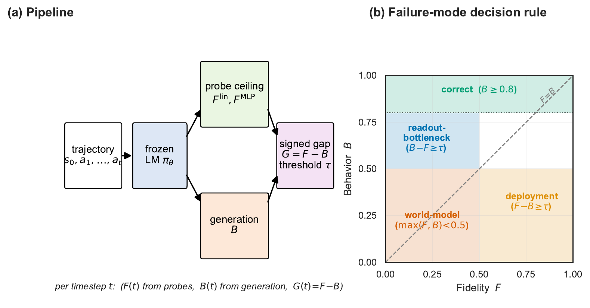
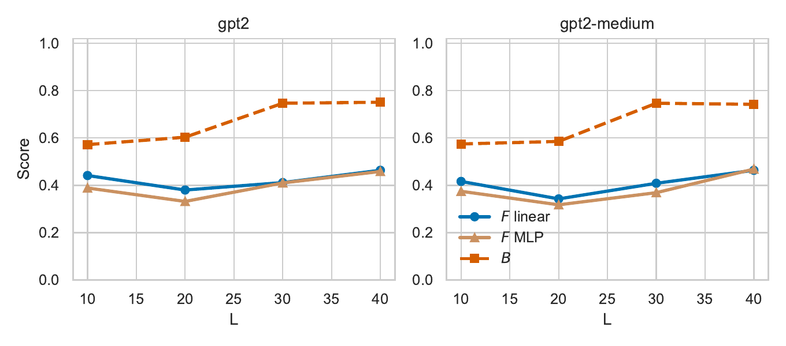
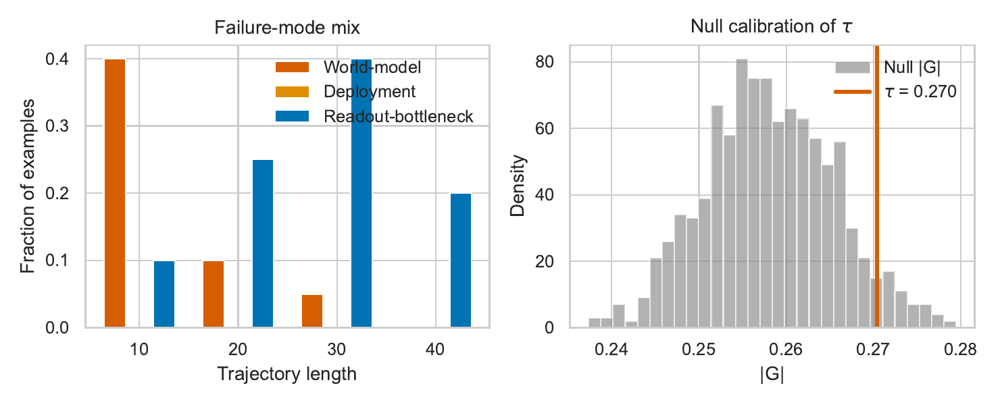

# Knowing vs. Saying

**A calibrated way to tell whether an LLM agent's failures come from a broken internal
world model, or from a model that knows the right answer but doesn't say it.**

*Knowing vs. Saying: A Calibrated
Dissociation Test for LLM Agents*

---

## The problem this solves

When an LLM agent gets something wrong, there are two very different explanations:

1. **It forgot the state.** Its internal representation of the world no longer
   tracks what's actually true (a *world-model* failure).
2. **It knew, but didn't say it.** The information is sitting right there in its
   hidden activations, but the text it generates doesn't use it (a *deployment*
   failure).

Looking at outputs alone can't tell these apart — both look identical from the
outside: the agent gets the answer wrong. But the fixes are completely different.
A broken world model needs more memory, more context, or better training. A model
that knows-but-doesn't-say needs better decoding or fine-tuning, not more
representational capacity.

## What we built

We built the **dissociation test**: at every step of a trajectory, we measure two
numbers and take their difference.

```
G(t) = F(t) − B(t)
```

- **F(t)** — *fidelity*: how much of the true state a probe can recover from the
  model's hidden activations (we try a linear probe, an MLP probe, and a
  random-label control probe, so this number is honest, not just an artifact of
  probe overfitting).
- **B(t)** — *behavior*: how much of the true state actually shows up in the
  model's own generated output.
- **G(t)** — the *signed gap*. We calibrate a threshold against a permutation
  null so a gap counts as real only when it's bigger than what chance alone would
  produce.

A large **positive** gap means the state is in there but isn't being used
(deployment failure). A large **negative** gap means the model's own generation
is somehow recovering more than any probe can — the information is real, but
distributed in a way no static probe can read out (a "readout bottleneck").
Small gaps mean fidelity and behavior roughly agree.



We test this on **Cart-State**, a small synthetic shopping-cart environment we
built specifically so the ground-truth state is always exactly known (no
ambiguity, no label noise), across three model families — GPT-2, Pythia-410M,
and instruction-tuned Qwen2.5-0.5B — and validate it again on five MiniGrid
tasks.



One of the headline findings: a trivial agent that just guesses default values
scores *higher* than every real model on a naively-scored slice of the task —
which is itself a warning about how easy it is to construct a misleading
behavioral baseline.



---

## Project structure

```
.
├── cart_state/       Synthetic shopping-cart environment + dataset generator
├── probing/          Extracts hidden states, trains linear/MLP/random probes
├── evaluation/       Scores the model's own generated JSON against ground truth
├── analysis/         Computes F, B, G, the permutation null, and statistics
├── interventions/    Activation patching, steering vectors, constrained decoding
├── minigrid_val/     Re-runs the same test on MiniGrid tasks
├── scripts/          End-to-end runners and figure/table generation
├── data/             Generated datasets (Cart-State, MiniGrid)
├── results/          Numbers, figures, and tables produced by a run
├── tests/            Unit tests (pytest)
├── paper/            The LaTeX source and compiled PDF
└── docs/images/      Preview images used in this README
```

Each folder under `cart_state/`, `probing/`, `evaluation/`, `analysis/`,
`interventions/`, and `minigrid_val/` corresponds to one stage of the pipeline —
they run in that order, feeding into each other.

---

## Running it yourself

**1. Install dependencies**

```bash
python -m pip install -r requirements.txt
```

**2. Run the quick smoke test** (a few minutes, small sample sizes, good for
checking everything works)

```bash
python scripts/run_all.py --quick
```

**3. Run the full pipeline** (reproduces every number and figure in the paper)

```bash
python scripts/run_all.py --full
```

Either command generates the Cart-State dataset, extracts hidden states, trains
the probes, scores model behavior, computes the fidelity-behavior gap, runs the
MiniGrid validation, runs the causal interventions, and writes every figure and
table into `results/` and `paper/`.

**4. Run the tests**

```bash
pytest
```

**5. Rebuild just the paper** (if you already have results and only changed the
LaTeX)

```bash
bash scripts/build_paper.sh
```

Everything is deterministic — the same seed always regenerates the same dataset
and the same numbers, so you can check your run against what's already in
`results/`.

---

## Data and compute

- **Cart-State**: 200 fully synthetic trajectories, exact ground truth at every
  step, released as JSON in `data/cart_state.json`.
- **MiniGrid**: a smaller validation set across five tasks, in `data/minigrid.json`.
- **Compute**: the full pipeline runs in well under two hours on a single laptop
  (no GPU cluster required) — it was originally developed and timed on an Apple
  M2 with the Metal backend.


## License

Code and the Cart-State dataset are released under the [MIT License](LICENSE).
